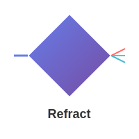

# Refract Documentation

<div align="center">



**A modern, reactive JavaScript UI framework**

[](https://refract-docs.netlify.app)
[](https://opensource.org/licenses/MIT)
[](https://github.com/refract-js/refract)
[](https://github.com/refract-js/refract)

*Bend light, bend reality. Build reactive UIs with precision.*

[**📖 Documentation**](https://refract-docs.netlify.app) • [**🚀 Quick Start**](#quick-start) • [**💡 Examples**](#examples) • [**🤝 Contributing**](#contributing)

</div>

---

## Overview

Refract is a cutting-edge JavaScript framework that brings reactive programming to the forefront of UI development. Inspired by the physics of light refraction, Refract bends the traditional paradigms of state management and component composition to create more intuitive, performant, and maintainable applications.

### Why Refract?

- **🔄 Reactive by Design**: Built-in reactivity with automatic dependency tracking
- **🎯 Precision State Management**: Fine-grained updates with minimal re-renders  
- **🧩 Composable Architecture**: Modular components with reusable logic patterns
- **⚡ Performance First**: Optimized rendering with intelligent batching
- **🛠️ Developer Experience**: Intuitive APIs with comprehensive tooling
- **📚 Comprehensive Documentation**: Complete guides, tutorials, and API references

## Quick Start

### Installation

```bash
# Create a new Refract app
npx create-refract-app my-app
cd my-app

# Or add to existing project
npm install refract-js
```

### Your First Component

```javascript
import { createComponent, createApp } from 'refract-js';

const Counter = createComponent(({ lens }) => {
  const count = lens.useRefraction(0);
  
  return (
    <div>
      <h1>Count: {count.value}</h1>
      <button onClick={() => count.set(count.value + 1)}>
        Increment
      </button>
    </div>
  );
});

const app = createApp();
app.mount(Counter, '#root');
```

### Key Features at a Glance

```javascript
// Reactive State (Refractions)
const user = lens.useRefraction({ name: 'Alice', age: 30 });

// Derived State
const greeting = lens.useDerived(() => 
  `Hello, ${user.value.name}!`, [user.value.name]
);

// Effects with Cleanup
lens.useEffect(() => {
  const timer = setInterval(() => console.log('tick'), 1000);
  return () => clearInterval(timer);
}, []);

// Composable Logic (Optics)
const useCounter = lens.useOptic((initialValue = 0) => {
  const count = lens.useRefraction(initialValue);
  const increment = () => count.set(prev => prev + 1);
  const decrement = () => count.set(prev => prev - 1);
  return { count: count.value, increment, decrement };
});
```

## Core Concepts

| Concept | Description | Use Case |
|---------|-------------|----------|
| **Refractions** | Reactive state containers with automatic dependency tracking | Managing component state, global stores |
| **Lenses** | Scoped access to framework features and component lifecycle | Accessing hooks, effects, and component context |
| **Optics** | Reusable logic units that encapsulate stateful behavior | Custom hooks, shared business logic |
| **Components** | Pure functions that return JSX with reactive capabilities | Building UI elements and layouts |
| **Effects** | Side effect management with automatic cleanup | API calls, subscriptions, DOM manipulation |

## Examples

### Counter App
```javascript
const Counter = createComponent(({ lens, initialValue = 0 }) => {
  const count = lens.useRefraction(initialValue);
  const step = lens.useRefraction(1);
  
  return (
    <div className="counter">
      <input 
        type="number" 
        value={step.value}
        onChange={(e) => step.set(parseInt(e.target.value) || 1)}
      />
      <button onClick={() => count.set(prev => prev - step.value)}>
        -{step.value}
      </button>
      <span>{count.value}</span>
      <button onClick={() => count.set(prev => prev + step.value)}>
        +{step.value}
      </button>
    </div>
  );
});
```

### Todo List with Persistence
```javascript
const TodoApp = createComponent(({ lens }) => {
  const todos = lens.useRefraction([]);
  const filter = lens.useRefraction('all');
  
  // Persist to localStorage
  lens.useEffect(() => {
    localStorage.setItem('todos', JSON.stringify(todos.value));
  }, [todos.value]);
  
  const addTodo = (text) => {
    todos.set(prev => [...prev, { 
      id: Date.now(), 
      text, 
      completed: false 
    }]);
  };
  
  const filteredTodos = lens.useDerived(() => {
    return todos.value.filter(todo => {
      if (filter.value === 'active') return !todo.completed;
      if (filter.value === 'completed') return todo.completed;
      return true;
    });
  }, [todos.value, filter.value]);
  
  return (
    <div className="todo-app">
      <TodoInput onAdd={addTodo} />
      <TodoFilters filter={filter} />
      <TodoList todos={filteredTodos.value} />
    </div>
  );
});
```

## Documentation Structure

This repository contains comprehensive documentation built with [Docusaurus](https://docusaurus.io):

```
refract-docs/
├── docs/
│   ├── intro.md                    # Framework introduction
│   ├── getting-started.md          # Installation and setup
│   ├── concepts/                   # Core framework concepts
│   │   ├── components.md
│   │   ├── refractions.md
│   │   ├── lenses.md
│   │   ├── optics.md
│   │   └── effects.md
│   ├── api/                        # Complete API reference
│   │   ├── overview.md
│   │   ├── createApp.md
│   │   ├── createComponent.md
│   │   ├── useRefraction.md
│   │   ├── useEffect.md
│   │   ├── useOptic.md
│   │   ├── useFlash.md
│   │   └── useLens.md
│   ├── tutorials/                  # Step-by-step guides
│   │   ├── counter-app.md
│   │   └── todo-list.md
│   └── contributing.md             # Contribution guidelines
├── src/                            # Custom documentation components
├── static/                         # Static assets and images
└── docusaurus.config.js           # Site configuration
```

## Development

### Prerequisites

- Node.js 16+ 
- npm or yarn

### Running Documentation Locally

```bash
# Clone the repository
git clone https://github.com/your-username/refract.git
cd refract/refract-docs

# Install dependencies
npm install

# Start development server
npm start

# Build for production
npm run build
```

### Project Scripts

```bash
npm start          # Start development server
npm run build      # Build for production  
npm run serve      # Serve production build
npm run clear      # Clear Docusaurus cache
npm run deploy     # Deploy to GitHub Pages
```

## Contributing

We welcome contributions from the community! Whether you're fixing bugs, adding features, improving documentation, or sharing feedback, your input helps make Refract better.

### Ways to Contribute

- 🐛 **Bug Reports**: Found an issue? [Open a bug report](https://github.com/refract-js/refract/issues/new?template=bug_report.md)
- 💡 **Feature Requests**: Have an idea? [Suggest a feature](https://github.com/refract-js/refract/issues/new?template=feature_request.md)
- 📖 **Documentation**: Improve our docs or add examples
- 🔧 **Code**: Submit pull requests for bug fixes or new features
- 💬 **Community**: Help others in discussions and issues

### Quick Start for Contributors

1. Fork the repository
2. Create a feature branch: `git checkout -b feature/amazing-feature`
3. Make your changes and add tests
4. Commit your changes: `git commit -m 'Add amazing feature'`
5. Push to the branch: `git push origin feature/amazing-feature`
6. Open a Pull Request

See our [Contributing Guide](./refract-docs/docs/contributing.md) for detailed information.

## Community

- 💬 **Discord**: [Join our community](https://discord.gg/refract)
- 🐦 **Twitter**: [@RefractJS](https://twitter.com/RefractJS)
- 📧 **Email**: hello@refract-js.org
- 📰 **Blog**: [refract-js.org/blog](https://refract-js.org/blog)

## License

This project is licensed under the MIT License - see the [LICENSE](LICENSE) file for details.

## Acknowledgments

- Inspired by React's component model and Vue's reactivity system
- Built with modern web standards and best practices
- Created as part of the [Technical Writers Mentorship Program](https://github.com/Technical-writing-mentorship-program)

---

<div align="center">

**[📖 Read the Docs](https://refract-docs.netlify.app) • [🚀 Get Started](https://refract-docs.netlify.app/docs/getting-started) • [💡 See Examples](https://refract-docs.netlify.app/docs/tutorials/counter-app)**

Made with ❤️ by the Refract community

</div>
